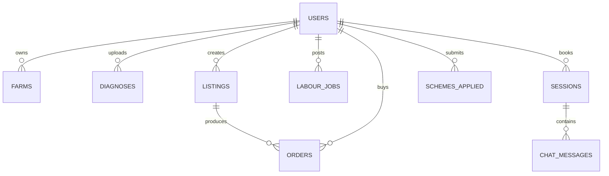
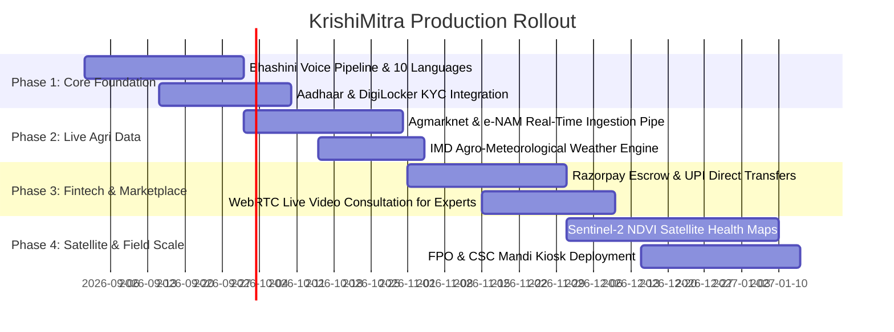

# 🌾 KrishiMitra — Real-World AgriTech Platform Specification (SYSTEM.md)

> **Document Version**: 2.0.0  
> **Target Audience**: Cloud Engineers, Full-Stack Developers, AI Coding Assistants (Claude / Gemini / ChatGPT), Product Architects  
> **Purpose**: Complete blueprint to convert the KrishiMitra frontend prototype into a production-grade, distributed, real-world Indian AgriTech ecosystem.

---

## 📌 1. System Vision & Business Architecture

### 1.1 Objective
KrishiMitra is a mobile-first, voice-enabled, offline-resilient digital agricultural ecosystem designed to empower over 140 million Indian farmers, rural workers, FPOs (Farmer Producer Organisations), agricultural scientists, and wholesale buyers.

### 1.2 Core User Personas & Value Propositions
1. **Farmer (किसान)**:
   - Real-time AI crop disease diagnosis with instant treatment plans in Hindi/regional languages.
   - Live Agmarknet Mandi prices, MSP alerts, and direct buyer listing with zero middleman exploitation.
   - One-tap booking for seasonal farm labour and heavy agricultural machinery (tractors, harvesters, seeders).
   - Direct tele-consultation with certified ICAR/IARI agricultural scientists.
   - Credit score estimation and 1-click application for PM-KISAN, KCC, and PMFBY.
2. **Agricultural Expert (विशेषज्ञ)**:
   - Live consultation queue, digital prescription generator, earnings ledger, and appointment scheduler.
3. **Crop Buyer / Trader (खरीदार)**:
   - Direct-from-farm procurement catalog, quality verification, organic filters, and escrow payments.
4. **Rural Labourer / Operator (श्रमिक / चालक)**:
   - Daily wage job discovery, skill-based hiring, and instant daily payout tracking.
5. **System Administrator (एडमिन)**:
   - User verification, dispute arbitration, transaction monitoring, and FPO management.

---

## 🏗️ 2. Current Architecture (As-Is) vs. Real-World Target (To-Be)

| Component | Current Prototype (As-Is) | Real-World Production Architecture (To-Be) |
| :--- | :--- | :--- |
| **Frontend** | React 19 + Vite 8 + React Router v7 + Vanilla CSS | React 19 PWA with Next.js 15 / SSR or Capacitor.js for native Android APK distribution |
| **Language & i18n** | Zero-dependency Hindi & English JSON | 12 Indian Languages (Hindi, Marathi, Punjabi, Gujarati, Telugu, Tamil, Kannada, Bengali, Odia, etc.) via format.js / i18next + Audio narration |
| **Voice & Speech** | Client-side Web Speech API | AI Speech-to-Intent pipeline using Bhashini API (Govt of India AI) + OpenAI Whisper + Coqui TTS |
| **AI Crop Doctor** | Gemini / Claude API via serverless proxy | Dual-layer: On-device TensorFlow Lite / ONNX model (offline) + Cloud Vision fine-tuned on ICAR/PlantVillage dataset |
| **Mandi Prices** | Simulated Agmarknet data service | Live integration with `Data.gov.in` Agmarknet API + e-NAM REST API with Redis caching & Cron sync |
| **Weather** | WeatherAPI.com with localStorage cache | IMD (India Meteorological Dept) + Open-Meteo agro-weather API with micro-climate rain radars & frost alerts |
| **Database & Auth** | Firebase Phone Auth + Firestore IndexedDB | Firebase / Supabase Auth with Aadhaar / DigiLocker KYC + Cloud PostgreSQL (TimescaleDB for Mandi timeseries) + Redis |
| **Payments** | Simulated checkout | Razorpay / PhonePe / Cashfree UPI integration with Escrow & Automated Direct Benefit Transfers (DBT) |
| **Expert Consult** | Booking UI state | WebRTC live video/audio rooms (LiveKit / Agora) + subcollection real-time message chat |
| **Notifications** | In-app Firestore snapshots | Multi-channel: WhatsApp Business API (Meta Cloud / Gupshup) + SMS (MSG91 / CDAC) + Web Push |
| **Satellite Imagery**| Mock health bars | Google Earth Engine / Sentinel-2 API for NDVI, NDRE, and soil moisture satellite maps |

---

## 📊 3. Database Schema & Data Models

### 3.1 Entity Relationship Diagram (Conceptual)


### 3.2 Core Firestore / PostgreSQL Collections

```typescript
// 1. User Profile
interface User {
  uid: string;
  phone: string; // E.164 (+91XXXXXXXXXX)
  name: string;
  role: 'farmer' | 'expert' | 'buyer' | 'worker' | 'admin';
  language: 'hi' | 'en' | 'mr' | 'te' | 'pa' | 'gu';
  village: string;
  district: string;
  state: string;
  pincode: string;
  coordinates?: { lat: number; lng: number };
  isKycVerified: boolean;
  kycDocType?: 'aadhaar' | 'kisan_credit_card';
  createdAt: string;
}

// 2. Farm Entity
interface Farm {
  id: string;
  userId: string;
  landAreaAcres: number;
  soilType: 'black' | 'alluvial' | 'red' | 'clay' | 'sandy';
  irrigationSource: 'canal' | 'borewell' | 'drip' | 'rainfed';
  activeCrops: Array<{
    cropName: string;
    variety: string;
    sowingDate: string;
    expectedHarvestDate: string;
    healthIndexScore: number; // 0 - 100
  }>;
}

// 3. AI Crop Diagnosis
interface Diagnosis {
  id: string;
  userId: string;
  cropName: string;
  diseaseNameEn: string;
  diseaseNameHi: string;
  severity: 'Low' | 'Medium' | 'High' | 'Critical';
  confidencePercent: number;
  imageUrl: string;
  treatmentSteps: string[];
  preventiveMeasures: string;
  audioVoiceUrl?: string;
  verifiedByExpertId?: string;
  createdAt: string;
}

// 4. Marketplace Listing & Orders
interface CropListing {
  id: string;
  farmerId: string;
  farmerName: string;
  crop: string;
  variety: string;
  quantityQuintals: number;
  askingPricePerQuintal: number;
  mspBenchmarkPrice: number;
  isOrganicCertified: boolean;
  location: { mandi: string; district: string; state: string };
  status: 'active' | 'under_bid' | 'sold' | 'cancelled';
  photos: string[];
  createdAt: string;
}

// 5. Expert Consultation Session
interface ConsultationSession {
  id: string;
  farmerId: string;
  expertId: string;
  scheduledTime: string;
  status: 'scheduled' | 'active' | 'completed' | 'cancelled';
  roomUrl?: string; // WebRTC room
  prescriptionNotes?: string;
  feeAmountINR: number;
  isDemoFree: boolean;
  rating?: number;
}
```

---

## 🔌 4. Real-World External API Integrations

### 4.1 Live Mandi Prices (`Data.gov.in` / e-NAM)
```
GET https://api.data.gov.in/resource/9ef84268-d588-465a-a308-a864a43d0070
Query Parameters:
  - api-key: ${DATA_GOV_IN_KEY}
  - format: json
  - filters[state]: "Madhya Pradesh"
  - filters[commodity]: "Wheat"
```

### 4.2 Bhashini AI (Govt. of India Language Model)
- **Pipeline**: Automated Speech-to-Text (ASR) + Text-to-Text Translation (NMT) + Text-to-Speech (TTS) for 22 Indian regional languages.
- **Endpoint**: `https://dhruva-api.bhashini.gov.in/services/inference/pipeline`

### 4.3 Hyper-Local Agricultural Weather (IMD / Open-Meteo)
- Hourly soil temperature at 0-7cm depth, volumetric soil moisture, evapotranspiration, and GDD (Growing Degree Days).
- `https://api.open-meteo.com/v1/forecast?latitude=23.25&longitude=77.41&hourly=soil_temperature_0cm,soil_moisture_0_to_1cm,evapotranspiration`

### 4.4 Automated WhatsApp & SMS Messaging
- **Daily 6:00 AM Mandi & Weather Digest**:
  > "🌾 *शुभ प्रभात रमेश जी!* आज सीहोर मंडी में सोयाबीन का भाव ₹5,140 (+₹45) है। कल शाम बारिश की 60% संभावना है। कीटनाशक छिड़काव आज दोपहर 2 बजे से पहले करें।"

---

## 🔒 5. Security, KYC & DPDP Compliance

1. **Aadhaar & Mobile Authentication**:
   - Masked OTP verification with encrypted PII storage.
   - Compliance with the **Digital Personal Data Protection (DPDP) Act 2023**.
2. **Escrow Financial Protection**:
   - Buyers deposit funds into an escrow account. Payout is released to the farmer immediately upon delivery confirmation at the Mandi scale.
3. **Zero Data Leakage on Image Uploads**:
   - Crop scan images stripped of EXIF metadata before processing.

---

## 🚀 6. Step-by-Step Production Roadmap



---

## 🤖 7. Master AI Cloud Prompts (Copy-Pasteable for Claude / LLMs)

### 📋 Master Prompt A: Backend & API Engineering
```text
You are a Principal Cloud Architect building the production backend for "KrishiMitra" — India's premier AgriTech platform for 100M+ farmers.

Given the frontend architecture in React 19 + Vite 8:
1. Design and generate a modular backend (FastAPI / Node.js Express with TypeScript) connected to PostgreSQL and Redis.
2. Implement the following microservices:
   a. /api/v1/mandi: Ingest and cache daily market commodity prices from Data.gov.in Agmarknet API with Redis cache (1hr TTL) and historical trend sparklines.
   b. /api/v1/weather/agro: Ingest hyper-local weather with soil temperature, precipitation probability, and agricultural spray advisories.
   c. /api/v1/crop-doctor/analyze: Multi-modal vision analysis pipeline with disease classification, severity scoring, and regional Hindi/English voice outputs.
   d. /api/v1/payments/escrow: Razorpay/Cashfree webhook handlers for marketplace trade escrow.
   e. /api/v1/notifications/whatsapp: Cron worker sending scheduled WhatsApp/SMS daily updates to farmers.
3. Include Dockerfile, docker-compose.yml, environment variable schemas, and PostgreSQL migration scripts.
```

### 📋 Master Prompt B: Native Android & Bhashini Voice Integration
```text
You are an expert Mobile & AI Systems Engineer.
Extend the KrishiMitra web application to:
1. Wrap the existing Vite PWA with Capacitor.js / Android Studio to produce a production-ready Android APK (<10MB) optimized for low-end Android Go devices (2GB RAM).
2. Replace mock speech recognition with the Government of India Bhashini ASR/TTS API pipeline for seamless spoken Hindi, Marathi, Punjabi, Gujarati, and Telugu.
3. Implement offline SQLite caching with background WorkManager synchronization so farmers can scan crops and record audio notes without active internet.
```
